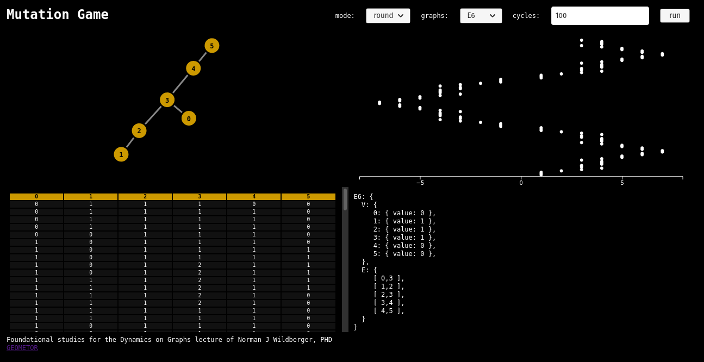

# Dynamics on Graphs Explorer

This repository is currently a sandbox for mathematical investigations into exceptional structures and dynamics on graphs.

The studies will be inspired by the concepts  covered in Norman J. Wildberger's  [Wild Egg Maths ](https://www.youtube.com/channel/UCriFv3G22iOUidUhkIGXuhw) channel on youtube.

The first exercise on the mutation game can be found here:

[DoG 1: The Mutation Game and a foundational exercise / challenge | Explore Research Maths | Wild Egg](https://www.youtube.com/watch?v=u7cUXZHZHEE)

## DoG:1
### mutation game exercise



In the video linked above, Dr. Wildberger discusses the mutation game on graphs and presents the following exercise / challenge:

> Which simple graphs `X` have a finite number of root populations?

A root of `X` is a population obtainable from a singleton population by successive mutations. 

Let `R(X) ≡ roots of X`

This first project presents a test rig for playing the mutation game on selected graphs 

[Play the mutation game](https://geometor.github.io/graphs/)

I have built a test rig using HTML, CSS, JS. And I have included one library: [D3](https://d3js.org/) 

D3 is handling the rendering of the graph (upper-left), the population history table (lower-left), and the population history plot (upper-right).

Each graph is defined as a simple JS structure of vertices `V` and edges `E` 

```javascript
simple: {
  V: {
    x: {},
    y: {},
    z: {},
    w: {}
  },
  E: [
    [ "y", "x" ],
    [ "y", "z" ],
    [ "y", "w" ],
    [ "z", "w" ]
  ]
}
```
Before the game is run the graph is set with a singleton population - where all the vertices are given a value of zero except the first, which is given a value of one.  

This test rig will run the mutation operation on the vertices for a set number of iterations (cycles). You can choose whether to select a random vertex each time or run round-robin. 

The mutation operation is simple - negate the value of the selected vertex and add the sum of the values of the neighboring vertices.

At each iteration, the population is added to a history array which is then displayed as a table and plot - starting from bottom to top. 

The points on the plot show the sum of the population at each iteration. 

## Next steps
- Determine the set of root populations
- Determine min-max sum of populations
- Plot vertex values


